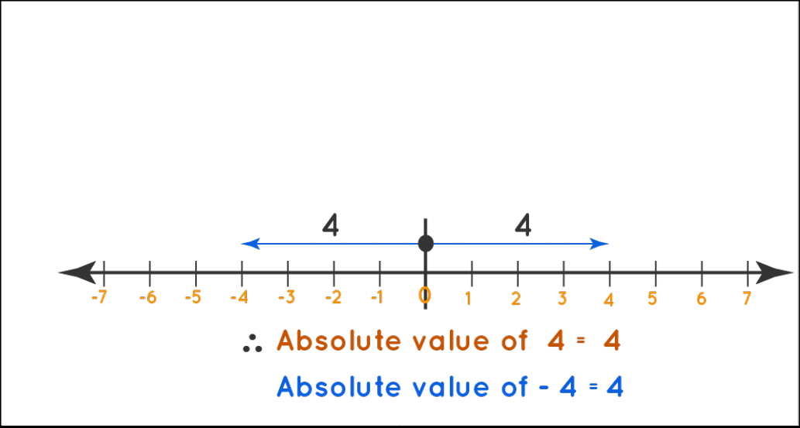

# Data Representation

Numbers are the way that computers speak. They don't understand anyhting but 1s and 0s. So in order to understand how to communicate with computers, you will need to learn the number systems that they know.

## Numbering Systems:

- **Psoitional number** - A system for establishing how numeric values are represented.

- **Base** - Simplest structure of a number system.

In the number: 584

The leftmost digit “5” is called the **most significant bit**. While the rightmost is the **least significant bit**.

### Binary - Digital Values:

The number eleven:

- **Binary** - 01011

Binary or Base 2, represented by 0's and 1's, is the computers language

- **Decimal** - 11

Decimal or base 10, is the numbering system we use in day to day life.

- **Hexadecimal** - B

Hexadecimal or base 16, this is used to simplify binary so we don’t have hundreds of 0’s and 1’s.

## Order of Magnetude:

Orders of magnitude is a system to represent very large numbers in scientific notation. 
When we are discussing things such as data speed, power, voltage, and frequency we use base 10.
When we are discussing storage or memory capacity we use base 2.

WhatIs.com. 2022. What is order of magnitude?. [online] Available at: <https://www.techtarget.com/whatis/definition/order-of-magnitude> [Accessed 24 May 2022].

If we say something is to the second power for example: 102

It is the number 10, times itself twice.  Which equals 100. In contrast we could subtract or add using orders of magnitude: 103 - 102 written out: 1,000 - 100 = 900

This should not be confused with subsets.  Subsets is how we can show what numberline we are working in.  Example: 35    means that the number 3510 is a decimal number.

## Multiples of Bits:

Looking at this chart, a kilobit is: 103

We can also see that a terabit is 1012

Knowing this we know that a terabit is 109 larger than a kilobit

With a kilobit being: 1,000

And a terabit being: 1,000,000,000,000

## Binary:

Binary is base 2. So when we are writing it out we put the following:

So let’s say we have the number 215.  In order to represent this number in binary we need to turn digits on or off.

## Signed Arithmatic:

Signed integers are whole numbers with a sign and are represented in two’s complement format. The **most significant** bit holds the sign where zero is positive and one is negative (sign bit). Thus, a byte would only have seven bits for the integer’s magnitude. A byte sized value can now only contain 7 bits worth of info because the last bit is used for the sign bit.

In signed arithmetic we have absolute values.  This is the magnitude of the number regardless of its sign.  For example the absolute value of 4 or -4 in signed arithmetic is 4.

